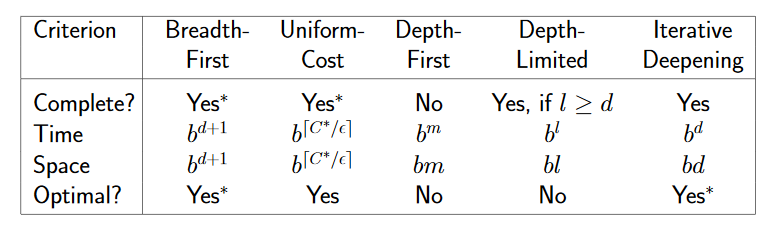

# 人工智能

## 搜索

DFS using stack （正常的递归）

DFS using heap（循环，每次`heap.pop()`，再将pop出的节点的后继加入heap中，直到找到目标） p13

General tree search

General graph search：要考虑节点是否已经被访问

评估：完备性（如果有解，是否一定能找到），时间复杂度，空间复杂度，最优性

### Uniformed search

只使用问题定义中的信息

$b$搜索树宽度，$d$解的深度；$m$状态空间的深度（可以是$\infty$），$g$路径开销

- Breadth-first search
  - heap是FIFO queue
  - 完备性：如果$b$有限
- Uniform-cost search
  - 解决边有权重的问题，Priority queue，权重最小先出栈
  - 当边权重为正时完备
  - 时空复杂度都是路径开销$\leq$最优解的节点个数
  - 最优性证明：
    - 它扩展最小成本的节点
    - 最优路径上的目标状态比任何次优路径上的目标状态具有更小的成本
    - 它永远不会在扩展最优路径上的目标状态之前，扩展次优路径上的目标状态
- Depth-first search
  - heap是LIFO queue
  - 不完备：在无限深度空间、有环的空间中失败（如果有限、没有重复状态则完备）

- Depth-limited search

- Iterative deepening search

  - 对从0到$\infty$的depth，分别做Depth-limited search，直到找到结果

  - 时间复杂度（实际上重复搜索浪费的时间并不多）：
    $$
    \begin{aligned}
    &b^0+(b^0+b^1)+\dots+(b^0+\dots+b^d)\\
    =&(d+1)b^0+db^1+\dots+b^d=O(b^d)
    \end{aligned}
    $$

### Informed Search

- Greedy Search

  - heuristic function: $h(n)$ 为从$n$到最近目标的成本估计
  - 扩展**看起来**最接近目标的节点
  - 不完备（可以卡在环上），$T=O(b^m)$，$S=O(b^m)$，不最优

- A\* Search

  - heuristic function: $f(n)=g(n)+h(n)$，其中$g(n)$为到目前为止达到$ n $的成本，$h(n)$为从$n$到最近目标的成本估计，$f(n)$为通过$ n $到达目标的路径的估计总成本
  - Admissible可接受：估值永远小于真实值，$0\leq h(n)\leq h^*(n)$
  - Consistent一致性：$h(n)\leq c(n,a',n')+h(n')$，其中$ n' $是由动作$ a' $生成的$ n $的后继，Consistent$\to$Admissible
  - 证明：对于树搜索，如果启发式函数是可接受的，则A\*最优**（重点理解）**
    - 假设$h$是admissible的，如果$A$是最优目标节点，$B $是次优目标节点，下证明：$A$会比$B$先扩展
      - 对于$A$的任意祖先$n$，证明：$n$会比$B$先扩展
      - 有$h(A)=h(B)=0$；$g(A)<g(B)$
      - $g(n)+h(n)\leq g(A)=g(A)+h(A)<g(B)+h(B)$，得证：$A$的所有祖先都会在$B$之前扩展，所以$A$会比$B$先扩展。得证：A\*最优
    - 证明：对于图搜索，如果启发式函数是一致的，则A\*最优
      - 证明：$g (n) + h(n) $的值沿着任何路径都是非递减的
      - $ n' $是由动作$ a' $生成的$ n $的后继，$g(n')+h(n')=g(n)+c(n,a',n')+h(n')\geq g(n)+h(n)$
            - 证明：当目标节点$n$展开时，已找到到目标结点的最优路径
      - 否则存在另一个在最优路径上的前沿节点$n'$，它的目标节点是$n_2$，有$g(n')+h(n')\leq g(n_2)+h(n_2)<g(n)+h(n)$，则$n'$会比$n$更早展开，矛盾，得证
  - dominate主导：对于可接受的$h_1,h_2$，对任意$n$都有$h_2(n)\geq h_1(n)$；主导的更好
  - 松弛问题：admissible heuristic是更松弛问题的精确开销，松弛问题的开销$\leq$真实问题的开销
  
- Adversarial Search对抗性搜索

  - Minimax Algorithm（两玩家零和博弈）

    - 构造博弈树，后向归纳，MAX玩家选择最大的，MIN玩家选择最小的
      $$
      \text{Minimax}(s) = \left\{\begin{aligned}
      &\text{Utility}(s)&&\text{if Terminal-Test}(s)\\
      &\max_{a\in\text{Actions}} \text{Minimax}(\text{Result}(s,a))&&\text{if Player}(s)=\text{Max}\\
      &\min_{a\in\text{Actions}} \text{Minimax}(\text{Result}(s,a))&&\text{if Player}(s)=\text{Min}
      \end{aligned}\right.
      $$
  
- 完备，对理性对手最优，$T=O(b^m)$，$S=O(bm)$
    - 解决冗余：alpha-beta pruning
      - 剪枝不影响最终结果，良好的顺序可以提高剪枝的效率
      - 搜索顺序很重要，先扩展可能是最好的后继
    - 解决有限资源问题：深度设限，使用近似的evaluation function而不是实际的utility function
    
- H-Minimax：使用cutoff-test，深度有限；使用evaluation function
  
- Expect-Minimax：非确定性博弈，引入概率
  
- $\epsilon$-greedy：以$\epsilon$的概率尝试随机；以$1-\epsilon$选择最优；$\epsilon$平衡探索和利用

- Softmax：以$\displaystyle P(k)=\frac{e^{Q(k)/\tau}}{\sum_{i=1}^Ke^{Q(k)/\tau}}$，$\tau$控制平衡，越大越探索

- UCB：选择average reward+upper confidence bound$\displaystyle Q(k)+\sqrt{\frac{2\ln n}{n_k}}$最大的

  - $n$：总尝试次数，$n_k$尝试$k$的次数
  - 由Chernoff Hoeffding Bound，$P(|\tilde p-p|\leq\delta)\geq 1-2e^{-2n\delta^2}$，其中$\tilde p$为样本均值，$p$为分布均值
  - $\displaystyle \tilde p-\sqrt{\frac{2\ln n}{n_k}}\leq p\leq \tilde p+\sqrt{\frac{2\ln n}{n_k}}$以$\displaystyle 1-\frac{2}{n^4}$的概率成立
  - 在不确定性面前保持乐观，从而帮助智能体对环境进行探索，理论上可以证明UCB是强化学习智能体最优的探索策略

- MCTS（Monte-Carlo Tree Search）也称UCT（Upper-Confidence Tree）

- 

### General Solution Space Search

- 连续空间中的贪心思想
  - 离散化并使用爬山法