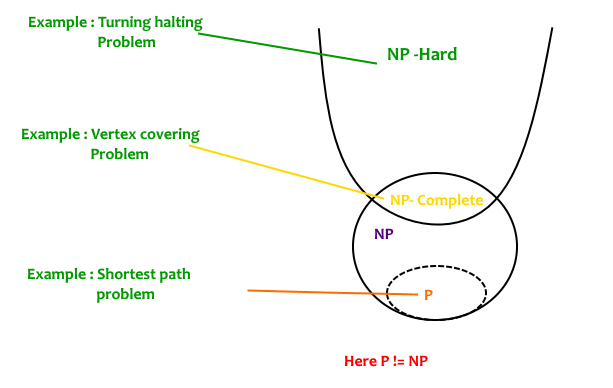

# 数据结构与算法

## P和NP问题



- Decision problem: A problem with a yes or no answer.

### P Problem

*P is a complexity class that represents the set of all decision problems that can be solved in polynomial time*. That is, given an instance of the problem, the answer yes or no can be decided in polynomial time.

可以在多项式时间内求解的决策问题的。

### NP Problem

*NP is a complexity class that represents the set of all decision problems for which the instances where the answer is "yes" have proofs that can be verified in polynomial time.* This means that if someone gives us an instance of the problem and a certificate (sometimes called a witness) to the answer being yes, we can check that it is correct in polynomial time.

验证问题，可以在多项式时间内验证答案是否正确的决策问题，但是不能确定是否在多项式时间内找到答案。

### NP-Complete Problem

NP集合中最难的问题，a decision problem L is NP-complete if

1. L is in NP
2. Every problem in NP is reducible to L in polynomial time

definition of **reduction规约**


找到一个从L1到L2的变换，使得P on x is yes iff Q on T(x) is yes。

例子：3SAT问题，是否存在赋值使得下式成立（$d$可以是$a$或$\neg a$，但是不能是$e,f$，否则就不是3SAT问题）

$$
(a \or b\or c)\and(d \or e\or f) \and \cdots
$$

顶点覆盖问题（Vertex Covering Problem）是一种组合优化问题，旨在寻找一个最小的顶点集合，使得图中的每条边都至少与该顶点集合中的一个顶点相邻。

### NP-hard

满足NP-complete的条件2即可。

## 排序算法

### 基本问题

#### 排序为什么要稳定？

稳定性的定义：对于值相同的两个元素，排序后它们的先后顺序与原数组相同。

因为在某些情况下，我们需要保留原数数据中的元素的相对位置。比如说对多个关键字排序，先按照关键字1排序，在关键字1相同的情况下再按照关键字2排序，在这种情况下，如果排序算法是不稳定的，那么在排序关键字2时就会打乱关键字1的顺序。

#### 为什么归并的最坏复杂度是$O(n\log n)$，快排是$O(n^2)$，但是大家用的都是快排？

因为实际上在大多数情况下，无论从时间复杂度还是空间复杂度的角度考虑，快排的性能均优于归并排序。

首先，从时间复杂度上看，平均情况下两者的时间复杂度都是$O(n\log n)$，但是由于归并排序需要进行分配和取消分配辅助数组等操作，其所需的常量时间更大。

其次，从空间复杂度上看，快速排序是原地排序in-place的，不需要额外的空间，而归并排序则需要额外分配数组。

最后，虽然在数组已有序的情况下，快排的最坏时间复杂度是$O(n^2)$，但是我们可以通过随机选取pivot而非直接使用最后一个元素，使得快排的时间复杂度是最坏情况的概率很小，甚至趋近于0。

此外，当数据存储在内存中时，快排更好；但是当数据存储在硬盘中时或数据是链表时，归并排序最好，因为它最小化了读写的时间。

#### 快排为什么叫“快”排？

因为它可以比任何其他排序方法更快地（两到三倍）对数据元素列表进行排序。

### 选择排序

**Selection sort** is a simple and efficient sorting algorithm that works by repeatedly selecting the smallest (or largest) element from the unsorted portion of the list and moving it to the sorted portion of the list. The algorithm repeatedly selects the smallest (or largest) element from the unsorted portion of the list and swaps it with the first element of the unsorted portion. This process is repeated for the remaining unsorted portion of the list until the entire list is sorted.

选择排序重复地选择从未排序的部分选择最小的元素，将其与未排序部分的第一个元素交换位置，再将未排序部分的第一个元素并入已排序部分。

### 插入排序

**Insertion sort** is a simple sorting algorithm that works similar to the way you sort playing cards in your hands. The array is virtually split into a sorted and an unsorted part. Values from the unsorted part are picked and placed at the correct position in the sorted part.

插入排序是一种简单的排序算法，类似于你整理手中的扑克牌的方式。该算法将数组虚拟地分成已排序部分和未排序部分。从未排序部分中选出值，将它们放置到已排序部分的正确位置上。

```python
def insertion_sort(arr):
    n = len(arr)
    for i in range(1, n):
        j = i
        while j > 0 and arr[j-1] > arr[j]:
            arr[j], arr[j-1] = arr[j-1], arr[j]
```

### 冒泡排序

**Bubble Sort** is the simplest sorting algorithm that works by repeatedly swapping the adjacent elements if they are in the wrong order.

冒泡排序通过反复交换相邻的元素进行排序。

```python
def bubble_sort(arr):
    n = len(arr)
    for i in range(n):
        for j in range(0, n-i-1): # Last i elements are already in place
            if arr[j] > arr[j+1]:
                arr[j], arr[j+1] = arr[j+1], arr[j]
```

### 快速排序

**Quick Sort** is a sorting algorithm based on the Divide and Conquer algorithm that picks an element as a pivot and partitions the given array around the picked pivot by placing the pivot in its correct position in the sorted array.

快速排序是一个基于分治的思想的排序算法，每次选择一个元素作为pivot，然后将给定的数组围绕这个基准进行划分，将小于基准的元素放到基准的左边，将大于基准的元素放到基准的右边，最终将基准放置在排序后的正确位置上。

```python
def quick_sort(arr, low, high):
    if low < high:
        pi = partition(arr, low, high)
        quick_sort(arr, low, pi-1)
        quick_sort(arr, pi+1, high)
  
def partition(arr, low, high):
    pivot = arr[high]
    i = low - 1
    for j in range(low, high):
        if arr[j] < pivot:
            i += 1
            arr[i], arr[j] = arr[j], arr[i]
    arr[i+1], arr[high] = arr[high], arr[i+1]
    return i+1
```

### 快速排序时间复杂度证明

假设数组被分成大小为$j$和$n-j$的两部分，则时间复杂度为

$$
T(n)=T(j) + T(n-j) + cn
$$

最好情况：

$$
\begin{aligned}
T(n) &= 2T\left(\frac n2\right) + cn\\
&=2 \left(2T\left(\frac n4\right)+c\cdot \frac{n}{2}\right) + cn\\
&=\cdots\\
&=2^{\log n} T(1) + c+2c + \dots + 2^{\log n}c\\
&= nT(1)+n\log n=O(n\log n)
\end{aligned}
$$

最坏情况：

$$
T(n)=T(n-1)+cn = c(1+2+\dots+n)=O(n^2)
$$

平均情况：

当index i是pivot时，

$$
T(n)=T(i)+T(n-i) +cn
$$

所以平均时间复杂度是：

$$
T(n)=\frac1n\sum_{i=1}^{n-1} T(i)+\frac1n \sum_{i=1}^{n-1}T(n-i) +cn=\frac 2n\sum_{i=1}^{n-1}T(i)+cn
$$

所以有：

$$
\begin{aligned}
nT(n)&=2\sum_{i=1}^{n-1}T(i)+cn^2\\
(n-1)T(n-1)&=2\sum_{i=1}^{n-2}+c(n-1)^2
\end{aligned}
$$

两式相减有：

$$
\begin{aligned}
nT(n)-(n-1)T(n-1)&=2T(n-1)+2cn-c\\
nT(n)&=(n+1)T(n-1)+2cn\quad (\text{remove constant c})
\end{aligned}
$$

两边同除$n(n+1)$

$$
\begin{aligned}
\frac{T(n)}{n+1}=&\frac{T(n-1)}{n}+\frac{2c}{n+1}\\
=&\frac{T(1)}{2}+2c\left(\frac12+\frac13+\dots+\frac1n+\frac1{n+1}\right)\\
=&\frac{T(1)}{2}+2c\log n+C
\end{aligned}
$$

可得

$$
T(n)=O(n\log n)
$$

### 归并排序

**Merge sort** is defined as a sorting algorithm that works by dividing an array into smaller subarrays, sorting each subarray, and then merging the sorted subarrays back together to form the final sorted array.

快速排序是一个基于分治的思想的排序算法，每次将数组分为两个子数组，分别对子数组排序，再将两个子数组归并，形成最终的排序好的数组。

```python
def merge_sort(arr, left, right):
    if left > right: return
    mid = (left + right) / 2
    merge_sort(arr, left, mid)
    merge_sort(arr, mid+1, right)
    merge(arr, left, mid, right)

def merge(arr, left, mid, right):
    left_arr = arr[:mid]
    right_arr = arr[mid:]
    i = j = k = 0
    while i < len(left_arr) and j < len(right_arr):
        if left_arr[i] <= right_arr[j]:
            arr[k] = left_arr[i]
            i += 1
        else:
            arr[k] = right_arr[j]
            j += 1
        k += 1
    while i < len(left_arr):
        arr[k] = left_arr[i]
        i += 1
        k += 1
    while j < len(right_arr):
        arr[k] = right_arr[j]
        j += 1
        k += 1
```

### 堆排序

Heap sort is a comparison-based sorting technique based on Binary Heap data structure.

堆排序是一种基于二叉堆数据结构的排序算法。首先根据未排序数组建立大顶堆，每次从堆中删除最大的元素（移动到数组末尾），再通过 `heapify`操作维护大顶堆的性质。`heapify`的具体操作为：如果根节点比左右子节点都大，则直接返回；否则交换根节点和值最大的节点，再递归地对原先值最大的节点调用 `heapify`。

```python
def heapify(arr, N, i):
    largest = i
    l = 2 * i + 1
    r = 2 * i + 2
  
    if l < N and arr[largest] < arr[l]:
        largest = l
    if r < N and arr[largest] < arr[r]:
        largest = r
    if largest != i:
        arr[i], arr[largest] = arr[largest], arr[i]
        heapify(arr, N, largest)

def heap_sort(arr):
    N = len(arr)
    for i in range(N//2-1, -1, -1):
        heapify(arr, N, i)
    for i in range(N-1, -, -1):
        arr[i], arr[0] = arr[0], arr[i]
        heapify(arr, i, 0)
```

### 计数排序

Counting sort is a sorting technique based on keys between a specific range. It works by counting the number of objects having distinct key values (a kind of hashing). Then do some arithmetic operations to calculate the position of each object in the output sequence.

计数排序（Counting Sort）是一种针对于特定范围之间的整数进行排序的算法。它通过统计给定数组中不同元素的数量（类似于哈希映射），然后对映射后的数组进行排序输出即可。

```python
def counting_sort(arr):
    count = [0 for i in range(m)]
    for e in arr:
        count[e] += 1
    for i in range(1, m):
        count[m] += count[m-1] # count[m]-1就是排序好的数组中m的最大idx
  
    for i in range(len(arr)-1, -1, -1): # 倒着遍历是为了保持in-place
        output[count[arr[i]]-1] = arr[i]
        count[arr[i]] - 1
  
    return output
```

### 基数排序

Radix sort is a non-comparison sorting algorithm that separates the elements to be sorted into different digits, and then sorts them according to each digit. This process requires the use of buckets to store the data. Radix sort can handle positive integers, negative integers, and decimals.

基数排序（Radix Sort）是一种非比较排序算法，它将待排序的元素按照位数切割成不同的数字，然后按照每个位数分别比较排序。这个过程中需要使用到桶（bucket）来存储数据。基数排序可以处理正整数、负整数和小数，只要数据能用位数表示，且位数有限。


### 桶排序

Bucket sort is a sorting algorithm that works by distributing the elements of an array into a number of buckets. Each bucket is then sorted individually, either using a different sorting algorithm, or by recursively applying the bucket sorting algorithm.

桶排序（Bucket Sort）是一种排序算法，它将待排序数组的元素分配到一定数量的桶中。每个桶单独进行排序，可以使用不同的排序算法或者递归地应用桶排序算法。


### 总结

| 算法       | 选择排序                                  | 插入排序                       | 归并排序                                                           | 快速排序         |  |
| ---------- | ----------------------------------------- | ------------------------------ | ------------------------------------------------------------------ | ---------------- | - |
| 额外空间   | $O(1)$                                  | $O(1)$                       | $O(n)$                                                           | $O(1)$，考虑栈$O(\log n)$ |  |
| 最好时间   | $O(n^2)$                                | $o(n)$（已排序好）           | $O(n\log n)$                                                     | $O(n\log n)$   |  |
| 平均时间   | $O(n^2)$                                | $O(n^2)$                     | $O(n\log n)$                                                     | $O(n\log n)$   |  |
| 最坏时间   | $O(n^2)$                                | $O(n^2)$                     | $O(n\log n)$                                                     | $O(n^2)$       |  |
| 稳定性     | n                                         | y                              | y                                                                  | n                |  |
| in-replace | y                                         | y                              | n                                                                  | y                |  |
| 优点       |                                           | 简单，小数组性能好，额外空间小 | 可并行，最坏性能有保障，对不同数据分布适应性好                     |                  |  |
| 缺点       | cache性能不好，读写太多，不能利用有序部分 | 时间复杂度太大                 | 空间复杂度高，递归算法需要调用栈，对于大数据集可能会stack overflow | 最坏复杂度无保证 |  |

| 算法     | 堆排序                        | 计数排序 | 基数排序                    | 桶排序                     |  |
| -------- | ----------------------------- | -------- | --------------------------- | -------------------------- | - |
| 额外空间 | $O(1)$                      | $O(n)$ | $O(n+b)$（b是进制）       | $O(n+k)$，$k$是桶数    |  |
| 最好时间 | $O(n\log n)$                | $O(n)$ | $O(d(n+b))$               | $O(n+k)$                 |  |
| 平均时间 | $O(n\log n)$                | $O(n)$ | $O(d(n+b))$               | $O(n+k)$                 |  |
| 最坏时间 | $O(n\log n)$                | $O(n)$ | $O(d(n+b))$d是位数        | $O(n+k)$                 |  |
| 稳定性   | n，操作在heap中，可能改变顺序 | y        | y                           | 取决于internal sorting alg |  |
| in-place | y                             | n        |                             | n                          |  |
| 优点     |                               |          | 快，并行，对int str快       | 并行                       |  |
| 缺点     |                               |          | 空间复杂度高，对float不友好 | 对不均匀分布的数据不友好   |  |

### 并查集


## 图

### 定义

- 连通：无向图，若从顶点v到顶点w有路径存在，则称v和w是连通的。
- 连通图：图G中的任意两个顶点都是联通的，则称图G是连通图。否则称为非连通图。
- 连通分量Connected components：无向图中的极大连通子图
- 强连通：有向图，若从顶点v到顶点w、从顶点w到顶点v之间都有路径，则称v和w是强连通的
- 强连通分量：有向图中的极大强连通子图
- 极大连通子图Maximum Connected Subgraph：图中的一组节点，这些节点之间互相可达，且无法再加入其他节点使其变得更大
- 极小连通子图：既要保持图连通，又要使得边数最少的子图。
- 图存储：

  - 邻接矩阵：用二维数组存储边的信息（各顶点之间的邻接关系）
  - 邻接表：对每个顶点v建立单链表，存储依附于依附于v的边
- 最小生成树Minimum spanning tree, MST：

  - 生成树是一棵包含图中所有节点的无向树，它的边数比节点数少1，且不形成环路。[求解：Prim, Kruskal]
  - MST：在带权连通图中使得所有边的权值之和最小的生成树。（不唯一，但是权值之和唯一）
- 有向无环图Directed Acyclic Graph, DAG：不存在环的有向图

### 最小生成树算法

#### 构造准则

1. 必须使用且仅使用该网络中的$ n-1 $条边来联结网络中的$ n $个顶点
2. 不能使用产生回路的边
3. 各边上的权值的总和达到最小

#### Kruskal

（基于边，适用于边稀疏的的网络）

```python
def kruskal(V, T):
    T = V # 初始化树，只含顶点
    numS = n # 连通分量数
    while numS > 1:
        从E中取出权值最小的边(v, u)
        if v和u属于T中不同的连通分量: # 用并查集的数据结构描述T
            T = T + {(u, v)}
            numS -= 1
```

时间复杂度为$O(|E|\log_2 \vert E\vert )$，适合求解边稀疏而顶点较多的图的MST

#### Prim

（基于顶点，适合于边稠密情形）

```python
def prim(G, T):
    T = {} # 初始化为空树
    U = {w} # 添加任意一个顶点w
    while U != V:
        (u, v) satisfies: 1. u in U; 2. v in (V-U); 3. is with minimum weight
        T = T + {(u, v)}
        U = U + {v}
```

时间复杂度为$O(\vert V\vert ^2)$。

### 最短路径

#### Dijkstra

边上权值非负情形的单源最短路径问题

```python
def dijkstra:
    dist[]: 记录从源点0到其他各顶点当前的最短路径长度。
	path[]: path[i]表示从源点到顶点i之间的最短路径的前驱结点。算法结束时可通过其回溯最短路径。
    S = {0}
    dist[i] = arcs[0][i] if arcs[0][i] else inf
  
    for time in range(n-1):
        选择j, 满足j in (V-S) and dist[j] = min(dist[i] | i in (V-S))
        S = S + {j}
        for k in (V-S): # 更新V-S中的所有顶点与0之间的距离
            dist[k] = max(dist[k], dist[j] + ards[j][k])
```

与Prim算法比较：也是基于贪心策略。

时间复杂度为$O(\vert V\vert ^2)$。

#### Bellman-Ford

边上权值为任意值的单源最短路径问题

```python
def BellmanFord(src):
    dist = [inf] * |V|
    dist[src] = 0
  
    # Step 2: Relax all edges |V| - 1 times. A simple shortest
    # path from src to any other vertex can have at-most |V| - 1
    # edges
    for i in range(|V|-1):
        for u, v, w in graph:
            if dist[u] != inf and dist[u] + w < dist[v]:
                dist[v] = dist[u] + w
        
    # Step 3: check for negative-weight cycles. The above step
    # guarantees shortest distances if graph doesn't contain
    # negative weight cycle. If we get a shorter path, then there
    # is a cycle.
    for u, v, w in self.graph:
        if dist[u] != float("Inf") and dist[u] + w < dist[v]:
            print("Graph contains negative weight cycle")
            return
```

时间：$O(|VE|)$

#### Floyd

求所有顶点之间的最短路径

```
for k=1 -> n:
	for i=1 -> n:
		for j=1 -> n:
			d[i,j] = min(d[i,j], d[i,k] + d[k,j])
```

只经过k的距离。

时间复杂度：$O(|V|^3)$，但是常数系数很小。

### 拓扑排序

AOV网（Activity on Vertex Network）：有向图，顶点表示活动的网络，用于DAG的表示和计算。每个结点表示一个任务，每条边表示结点间的依赖关系（这种前驱和后继关系有传递性）。

拓扑排序：当且仅当：1. 每个顶点出现且仅出现一次；2. 若顶点$A$在序列中排在顶点$B$前面，则在图上不存在从顶点$B$到顶点$A$的路径。每个AOV网都有一个或多个拓扑排序序列。

```python
def topological_sort(V):
    for (u, v) in E:
        indegree[u] += 1
        parent[v].append(u)
    for u in V:
        if indegree[u] != 0:
            stack.append(u)
  
    cnt = 0
    while stack:
    	u = stack.pop()
        cnt += 1
        for v in u.neighbor:
            indegree[v] -= 1
            if indegree[v] == 0:
                stack.push(v)
  
    if cnt != n:
        return False
    return True
```

### 如何判断图中是否有环？

1. 拓扑排序，最后如果还存在未被删除的顶点，则表示有环；否则没有环
2. DFS，如果在遍历的过程中，发现某个节点有一条边指向已经访问过的节点，并且这个已访问过的节点不是当前节点的父节点，则表示存在环（用黑白灰表示）
3. 对于有向图，若存在强连通分量（即存在$v_i \to v_j$的路径也存在$v_j\to v_i$的路径），图中有环。

### 欧拉图

定义：

- **欧拉回路**：通过图中每条边恰好一次的回路
- **欧拉通路**：通过图中每条边恰好一次的通路
- **欧拉图**：具有欧拉回路的图
- **半欧拉图**：具有欧拉通路但不具有欧拉回路的图

性质：

欧拉图中所有顶点的度数都是偶数。

若$G$是欧拉图，则它为若干个环的并，且每条边被包含在奇数个环内。

判断：

1. 无向图是欧拉图当且仅当：
   - 非零度顶点是连通的
   - 顶点的度数都是偶数
2. 无向图是半欧拉图当且仅当：
   - 非零度顶点是连通的
   - 恰有 0 或 2 个奇度顶点
3. 有向图是欧拉图当且仅当：
   - 非零度顶点是强连通的
   - 每个顶点的入度和出度相等
4. 有向图是半欧拉图当且仅当：
   - 非零度顶点是弱连通的
   - 至多一个顶点的出度与入度之差为 1
   - 至多一个顶点的入度与出度之差为 1
   - 其他顶点的入度和出度相等
