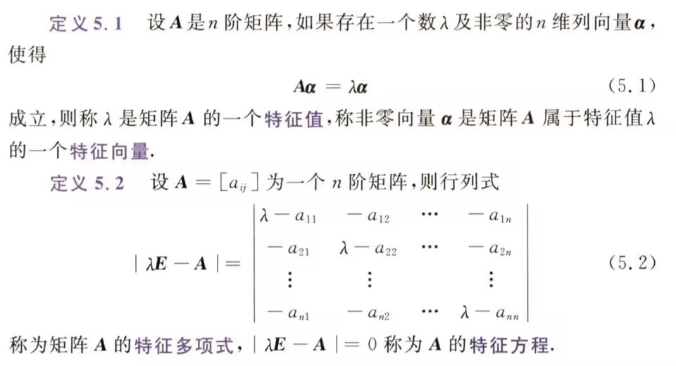
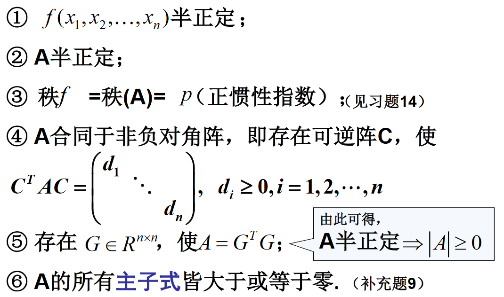
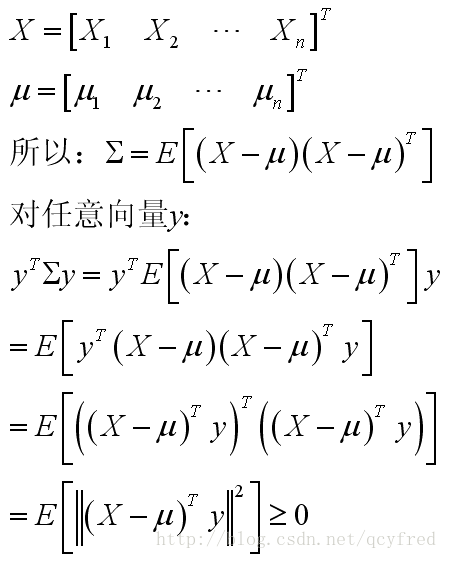

# 线性代数

## 线性空间

线性空间：定义了合法加法和数乘（加法和数乘满足相应8条规则）的非空集合。

线性相关：存在一组不全为零的标量（系数），使得向量之间的线性组合等于零向量

线性无关：不线性相关，当且仅当系数均为0时，线性组合才等于零向量。说明每个向量均独立，没有冗余信息

线性空间的维度：线性空间中最大线性无关组的大小

基：1. 线性无关 2. 线性空间中任意向量都可以用它们线性表出

线性子空间：

- 定义：1. 线性空间的非空子集 2. 对线性空间中的加法和数乘也构成数域上的线性空间
- 性质：交也是，和也是

## 高斯空间

## 矩阵

### 秩

矩阵的秩定义为矩阵中线性无关的行或列的最大数量，记作 $\text{rank}(A)$。

1. 反应矩阵的线性相关性
2. 矩阵的逆：满秩$\iff$可逆，即有唯一逆向量

### 矩阵分解的意义？

加速计算

### 奇异值分解

可以作用与长方矩阵上，同时包含了旋转、缩放和投影三种作用。

#### 什么是奇异值分解？

$A=U\Sigma V^\top$，其中$U,V$均为正交矩阵，$\Sigma$为对角矩阵，对角线上的值按从大到小排列。

#### 条件？

$AA^\top,A^\top A$可以被特征值分解。

#### 如何计算？

1. 对$A^\top A$进行特征值分解，得到特征值和特征向量。将特征值按照从大到小的顺序排列，特征向量也相应排序。$A^\top A$特征向量构成的正交矩阵，得到$V$。
2. 对$AA^\top$同理，得到$U$
3. 两次计算中的非零特征值从大到小排序，放在对角线，其他位置零。

#### 应用？

### 特征值分解

#### 什么是特征值和特征向量？

#### 条件？

$|\lambda E-A|$有非零解，只有可对角化矩阵才可以作特征分解。

#### 如何进行特征值分解？

特征值分解：指将对$n\times n$，且有$N$个线性无关的特征向量$q_i$的方阵$A$，将其分解为$A=Q\Lambda Q^{-1}$。其中$Q$为$n\times n$，第$i$列为$A$的特征向量$q_i$，$\Lambda$为对角矩阵，对角线上的元素是对应的特征值。

1. 首先求解特征方程，得到矩阵$A$特征值$\lambda _i$（共$n$个）

2. 再由$(\lambda_i E-A)x=0$求基础解系，即矩阵$A$属于特征值$\lambda_i$的线性无关的特征向量。
3. 用求得的特征值和特征向量构造$Q,\Lambda$

## 正定矩阵

### 正定

#### 正定二次型

##### 定义

实二次型 $f(x_1,x_2,\cdots,x_n)$ 若对任意一组不全为零的实数 $c_1,c_2,\cdots,c_n$ 都有

$$
f(c_1,c_2,\cdots,c_n)>0
$$

则称 $f$ 为**正定二次型**.

如, $f(x_1,x_2,\cdots,x_n)=\displaystyle\sum_{i=1}^nx_i^2$ 是正定二次型.

但, $f(x_1,x_2,\cdots,x_n)=\displaystyle\sum_{i=1}^{n-1}x_i^2$ 不是正定二次型.

##### 判定

1. 实二次型 $\boldsymbol{x}^\top A\boldsymbol{x}$ 正定 $\Leftrightarrow$ $\forall \boldsymbol{x}\in\mathbb{R}^n$, 若 $\boldsymbol{x}\neq 0$, 则 $\boldsymbol{x}^\top A\boldsymbol{x}>0$
2. 设实二次型 $f(x_1,x_2,\cdots,x_n)=d_1x_1^2+d_2x_2^2+\cdots+d_nx_n^2$, $f$ 正定 $\Leftrightarrow$ $d_i>0,i=1,2,\cdots,n$
3. 非退化线性替换不改变二次型的正定性
4. 设实二次型 $f(x_1,x_2,\cdots,x_n)$, $f$ 正定 $\Leftrightarrow$ $rank(f)=n=p$ ($f$ 的正惯性指数)

其中判定二的充分性显然, 必要性只需带入所有的单位向量即可证.

#### 正定矩阵

##### 定义

一个$n\times n$的实对称矩阵$A$被称为正定，如果对于任何非零向量$x\in\mathbb R^n$，都满足$x^\top  A x>0$

##### 判定

1. 实对称矩阵 $A$ 正定 $\Leftrightarrow$ $A$ 与单位矩阵 $E$ 合同
2. 实对称矩阵 $A$ 正定 $\Leftrightarrow$ 存在可逆矩阵 $C$, 使 $A=C^\top  C$

##### 性质

1. $A^{-1}$ 是正定矩阵
2. $kA,(k>0)$ 是正定矩阵
3. $A$ 的伴随矩阵 $A^*$ 是正定矩阵
4. $A^m$ 是正定矩阵 (m 为任意整数)
5. 若 $B$ 也是正定矩阵, 则 $A+B$ 也是正定矩阵

##### 必要条件

1. 实对称矩阵 $A=(a_{ij})_{n\times n}$ 正定 $\Rightarrow$ $a_{ii}>0,i=1,2,\cdots,n$
2. 实对称矩阵 $A$ 正定 $\Rightarrow$ $\det A=|A|>0$

##### 定理

二次型 $f(x_1,x_2,\cdots,x_n)=x^\top Ax$ 正定 (或 $A>0$) 的充分必要条件是 $A$ 的各阶顺序主子式都大于零.

证明：

$\Rightarrow$:

分别取 $\boldsymbol{c}=(c_1,c_2,\cdots ,c_k,0,\cdots,0)$, 带入可知 $f(x_1,x_2,\cdots,x_k)$ 也是正定二次型

$\therefore |A_k|>0$

$\Leftrightarrow$:

使用数学归纳法.

$E=G'A_{n-1}G$, 转化为对称矩阵

### 半正定

#### 协方差矩阵是半正定的

